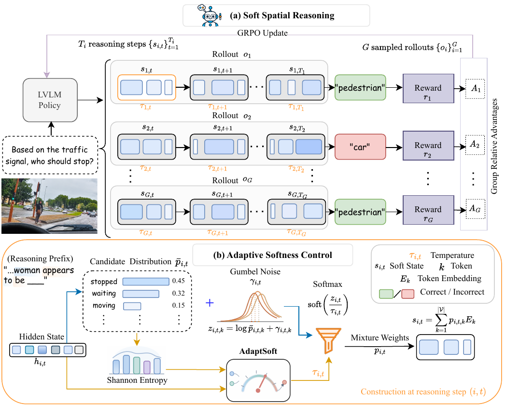
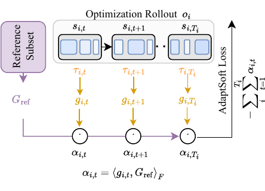
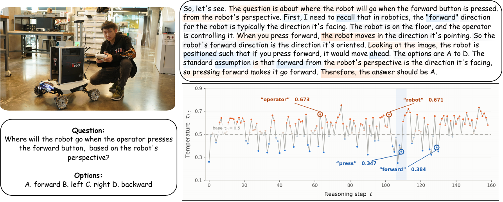

# Soft Spatial Reasoning

Official implementation of **Soft Spatial Reasoning**, a post-training framework that enables vision-language models to reason with adaptive continuous intermediate states on spatial tasks.

## Abstract

Large Vision-Language Models (LVLMs) commonly perform spatial reasoning through chain-of-thought, encoding intermediate reasoning as autoregressive sequences of discrete language tokens. This hard thinking requires committing to a single token at each step, even when the correct spatial interpretation remains uncertain. We propose **Soft Spatial Reasoning**, a post-training framework that introduces soft thinking for spatial tasks in LVLMs. At each intermediate reasoning step, the model forms a continuous soft state by mixing token embeddings rather than selecting a single token, allowing multiple candidate continuations to influence the next step.

The degree of softness can vary across reasoning steps. **AdaptSoft** uses the current hidden state and predictive uncertainty to set the temperature of each soft state. We train the controller with **gradient-alignment learning**, which provides step-specific supervision without requiring intermediate reasoning annotations. Across OmniSpatial, SpatiaLab, and MindCube, Soft Spatial Reasoning improves over hard and fixed-soft chain-of-thought baselines using the same backbone.

## Architecture



Soft thinking carries multiple candidate continuations through the reasoning trace, then switches to discrete generation for the final answer. AdaptSoft controls the token-mixture temperature using the current reasoning state and predictive uncertainty.





## Results

The reported experiments use **Qwen3-VL-8B-Thinking** as the backbone and train with GRPO on OmniSpatial.

| Benchmark | Soft Spatial Reasoning | Hard Thinking + GRPO | Soft Thinking + GRPO |
|---|---:|---:|---:|
| OmniSpatial | **49.68** | 45.92 | 46.93 |
| SpatiaLab (zero-shot) | **48.71** | 46.21 | 46.86 |
| MindCube (zero-shot) | **38.13** | - | - |

On OmniSpatial, the method improves over basic soft thinking by 2.75 points. On the unseen SpatiaLab benchmark, it improves over the strongest prior open-weights comparison by 2.93 points and transfers to spatial mental modeling on MindCube.

## Requirements

```bash
pip install -r requirements.txt
```

The implementation depends on PyTorch, Transformers, verl, SGLang, Ray, and the Qwen-VL utilities listed in `requirements.txt`. The patched runtime components required by soft thinking are included under `engine/`.

## Data

The training entry point expects train and test files in the format consumed by verl. Both paths are supplied explicitly:

| Dataset | Argument |
|---|---|
| OmniSpatial train split | `--train_file /path/to/OmniSpatial/train.parquet` |
| OmniSpatial test split | `--test_file /path/to/OmniSpatial/test.parquet` |

The prompt expects an image-based multiple-choice spatial question. The required response format is a brief chain-of-thought enclosed in `<think>...</think>`, followed by exactly one answer letter from `A` through `D`.

## Training

The launcher configures GRPO, soft rollouts, the AdaptSoft controller, and the patched verl/SGLang components. A representative 8-GPU run is:

```bash
CUDA_VISIBLE_DEVICES=0,1,2,3,4,5,6,7 torchrun --nproc_per_node=8 \
	adaptsoft_omnispatial_train.py \
	--model_name_or_path Qwen/Qwen3-VL-8B-Thinking \
	--train_file /path/to/OmniSpatial/train.parquet \
	--test_file /path/to/OmniSpatial/test.parquet \
	--output_dir /path/to/checkpoints/adaptsoft_8b \
	--num_gpus 8 \
	--num_generations 8 \
	--train_batch_size 64 \
	--total_steps 200 \
	--max_response_length 2048 \
	--learning_rate 1e-6 \
	--controller_lr 1e-3 \
	--soft_top_k 5 \
	--soft_noise_factor 1.0 \
	--adaptive_temperature True
```

Important controller settings are exposed by the launcher:

| Argument | Default | Description |
|---|---:|---|
| `--soft_top_k` | `5` | Number of candidate tokens mixed at each soft step |
| `--soft_noise_factor` | `1.0` | Gumbel-noise scale for stochastic soft rollouts |
| `--adaptive_temperature` | `True` | Enables AdaptSoft; `False` runs fixed-temperature soft thinking |
| `--controller_lr` | `1e-3` | AdaptSoft controller learning rate |

## Repository Layout

- `adaptsoft/`: soft forward pass, likelihoods, rewards, controller, and gradient alignment.
- `adaptsoft_omnispatial_train.py`: training entry point and runtime configuration.
- `engine/`: patched verl and SGLang components used to support soft thinking.
- `figures/`: figures from the accompanying paper.

## Citation

If you find this work useful, please cite:

```bibtex
@article{sultan2026softspatialreasoning,
	title={Soft Spatial Reasoning},
	author={Sultan, Rafi Ibn and Chowdhury, Md. Sajid Alam and Zare Zade, Saleh and Li, Chengyin and Khanduri, Prashant and Brocanelli, Marco and Zhu, Dongxiao},
	journal={arXiv preprint},
	year={2026}
}
```

## Links

- [Source code](https://github.com/rafiibnsultan/Soft_Spatial_Reasoning)
- [OmniSpatial benchmark](https://github.com/omni-spatial/OmniSpatial)